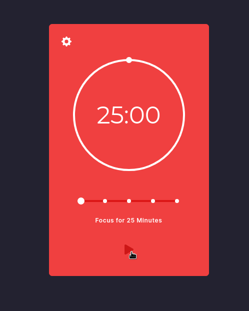

# Pomodox
app to manage work or study time with the pomodoro technique

## Preview


Example Online [Pomodox](https://pomodox-ten.vercel.app/)

## How Works

- Set the timer to the desired time (usually 25 minutes)
- After the focus period, you will take a short break, (usually 5 minutes)
- the process is repeated for up to 4 times and finally you will have a long break, (usually 15 minutes), resetting the step count and returning to step 0
  

## Tools
 - React Vite / [vite](https://vitejs.dev/)
 - Typescript
 - Hooks
 - Tailwindcss [Tailwindcss](https://tailwindcss.com/)
  
  #### third-party modules
 - ProgressBar / [progressBar](https://github.com/martyan/react-customizable-progressbar)
 - Slider / [slider-rc](https://github.com/react-component/slider)
 - react-icons [react-icons](https://react-icons.github.io/react-icons/)
## Installation

``` bash
npm install
```
or

``` bash
yarn install
```

## run project 

``` bash
npm run dev
```
or 
``` bash
yarn dev
```

### css is not really my focus, so there may be bugs related to responsive Design